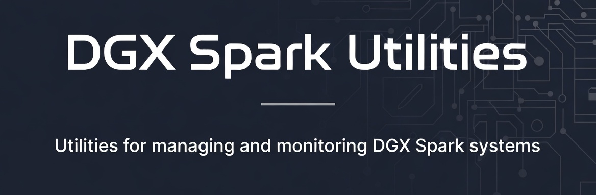

# NVIDIA DGX Spark Utilities

This repository contains various utilities and tools for NVIDIA DGX Spark devices. These utilities are designed to help with development, deployment, and management of applications running on NVIDIA DGX Spark systems with  integration.

## Overview

NVIDIA DGX Spark systems are purpose-built AI supercomputers that combine powerful GPU hardware with optimized software stacks for accelerated machine learning and data processing. This repository provides helpful utilities to streamline workflows when working with NVIDIA DGX Spark devices and Spark frameworks.

## Contents

This repository includes:

- **System monitoring tools** - Utilities for tracking GPU usage, memory consumption, and system performance
- **Spark optimization scripts** - Tools to optimize Spark configurations for DGX hardware
- **Deployment utilities** - Scripts and tools for deploying applications to DGX environments
- **Development helpers** - Scripts to simplify common development tasks on DGX systems
- **Benchmarking tools** - Utilities for performance testing and validation
- **NCCL automation** - Script to automate the complete NCCL setup process for DGX Spark nodes

## Prerequisites

- NVIDIA DGX system with appropriate drivers
- Spark framework installed
- Python 3.8 or higher
- Docker (for containerized utilities)

## Usage

Each utility is contained in its own directory with specific documentation. Please refer to individual utility READMEs for detailed usage instructions.

## Contributing

Contributions are welcome!

## Support My Projects

If you find this repository helpful and would like to support its development, consider making a donation:

### GitHub Sponsors

### Buy Me a Coffee

### PayPal

### Ko-fi

### Coinbase

Your support helps maintain and improve this collection of development tools and templates. Thank you for contributing to open source!

## License

This project is licensed under the MIT License - see the LICENSE file for details.