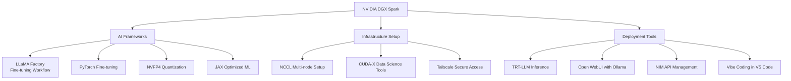
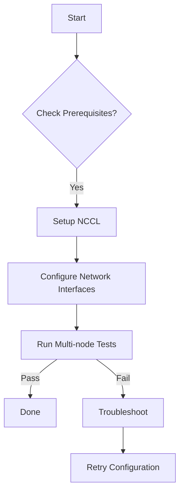
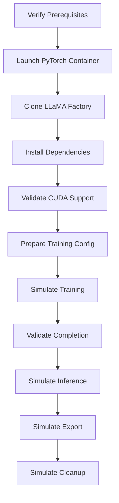

# NVIDIA DGX Spark Utilities

This repository contains various utilities and tools for NVIDIA DGX Spark devices. These utilities are designed to help with development, deployment, and management of applications running on NVIDIA DGX Spark systems with seamless integration.

## Overview

NVIDIA DGX Spark systems are purpose-built AI supercomputers that combine powerful GPU hardware with optimized software stacks for accelerated machine learning and data processing. This repository provides helpful utilities to streamline workflows when working with NVIDIA DGX Spark devices and Spark frameworks.

## Key Components Architecture

The following diagram shows the architecture of the NVIDIA DGX Spark Utilities ecosystem:

## Contents

This repository includes:

### AI Frameworks

- **LLaMA Factory automation** - Script to automate the complete LLaMA Factory workflow for fine-tuning large language models
- **PyTorch Fine-tuning** - Tools for fine-tuning machine learning models using PyTorch
- **NVFP4 Quantization** - Utilities for neural network quantization using FP4 format
- **JAX Optimized ML** - Scripts for optimizing machine learning workloads using JAX

### Infrastructure Setup

- **NCCL automation** - Script to automate the complete NCCL setup process for DGX Spark nodes
- **CUDA-X Data Science** - Tools for data science workflows using NVIDIA CUDA-X libraries
- **Tailscale Secure Access** - Scripts for setting up secure network connections between DGX nodes

### Deployment Tools

- **TRT-LLM Inference** - Tools for deploying LLM inference using TensorRT-LLM
- **Open WebUI with Ollama** - Web interface for running local LLMs with Ollama
- **NIM API Management** - Utilities for managing NVIDIA Inference Microservices
- **Vibe Coding in VS Code** - VS Code integration for AI coding assistance

## Core Workflows

### NCCL Setup Process

The following diagram illustrates the NCCL automation workflow:

### LLaMA Factory Automation

The LLaMA Factory workflow automation follows these steps:

## Prerequisites

- NVIDIA DGX system with appropriate drivers
- Spark framework installed
- Python 3.8 or higher
- Docker (for containerized utilities)
- Git installed

## Getting Started

1. Clone this repository
2. Navigate to the desired utility directory
3. Read the specific README for that utility
4. Follow the usage instructions for your workflow

## Usage

Each utility is contained in its own directory with specific documentation. Please refer to individual utility READMEs for detailed usage instructions.

## Contributing

Contributions are welcome! Please follow the guidelines in AGENTS.md for documentation standards and code quality requirements.

## Support My Projects

If you find this repository helpful and would like to support its development, consider making a donation:

### GitHub Sponsors

### Buy Me a Coffee

### PayPal

### Ko-fi

### Coinbase

Your support helps maintain and improve this collection of development tools and templates. Thank you for contributing to open source!

## License

This project is licensed under the MIT License - see the LICENSE file for details.
